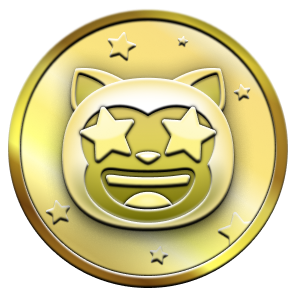
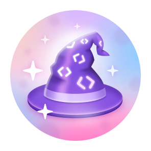

# GitHub Profile Badges & Achievements

> A complete, up-to-date list of every GitHub badge and achievement — how to get them, tiers, and tips.

## How to display achievements
Go to **Settings → Profile** and toggle on "Show achievements on profile".

---

## All earnable achievements (2026)

| Badge | Name | How to earn | Tiers (default / bronze / silver / gold) |
| :---: | :--- | :--- | :--- |
|  | **Starstruck** | Create a repo with many stars | 16 / 128 / 512 / 4096 |
|  | **Pull Shark** | Open PRs that get merged | 2 / 16 / 128 / 1024 |
|  | **Galaxy Brain** | Get a discussion answer accepted | 2 / 8 / 16 / 32 |
|  | **Pair Extraordinaire** | Co-author commits on merged PRs | 1 / 10 / 24 / 48 |
|  | **Quickdraw** | Close an issue/PR within 5 min | 1 (one time) |
|  | **YOLO** | Merge a PR without review | 1 (one time) |
|  | **Public Sponsor** | Sponsor via GitHub Sponsors | 1 (one time) |
|  | **Heart on Your Sleeve** | React to content on GitHub | Unknown |
|  | **Open Sourcerer** | Merge PRs in multiple public repos | Unknown |

---

## Profile Highlights

| Icon | Name | Description |
| :---: | :--- | :--- |
|  | **GitHub Pro** | Active GitHub Pro subscription |
|  | **GitHub Campus Expert** | Member of the GitHub Campus Expert program |
|  | **Developer Program Member** | Member of the GitHub Developer Program |
|  | **Security Advisory Credit** | Credited on a GitHub Security Advisory |
|  | **Security Bug Bounty Hunter** | Participant in the GitHub Bug Bounty Program |

---

## No longer earnable

| Badge | Name | Reason |
| :---: | :--- | :--- |
|  | **Mars 2020 Contributor** | NASA mission event ended |
|  | **Arctic Code Vault Contributor** | 2020 archive event ended |

---

## Skin tone variants
Starstruck and Quickdraw change appearance based on your emoji skin tone preference.
Set it at: **github.com/settings/appearance**

